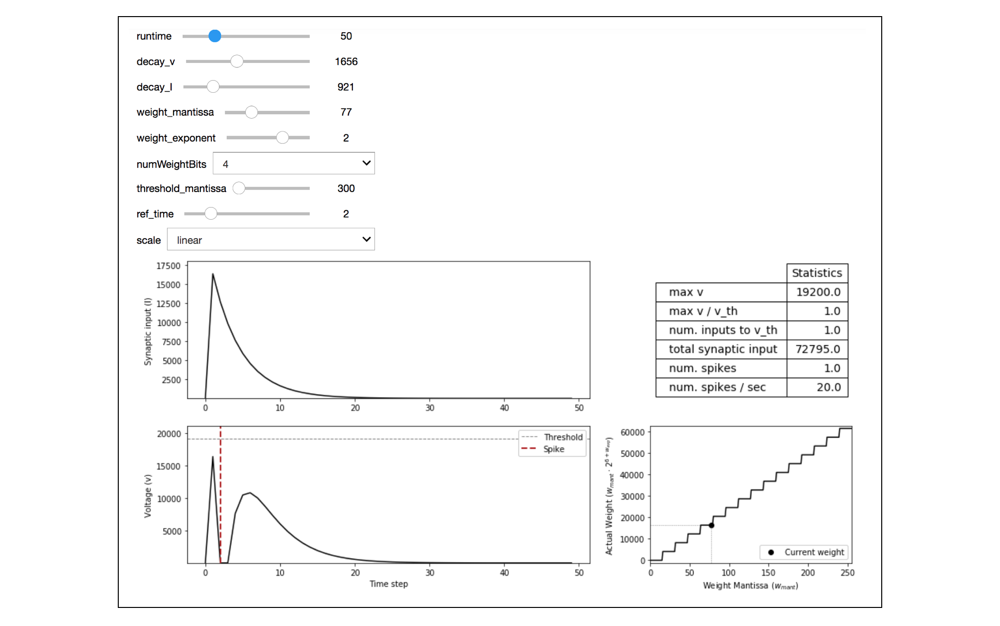

## Loihi Parameter Tuning Dashboard

This tool lets you change some of the main parameters on Loihi via an interactive dashboard. It is built on top of the Brian2Loihi Emulator (https://github.com/sagacitysite/brian2_loihi). 

### Requirements
- numpy
- ipywidgets
- matplotlib
- brian2 (2.4.2 or higher)
- brian2_loihi (0.5.2 or higher)

### Available Parameters
The following parameters can be manipulated within the tool:
- **runtime** (integer, 0...200): defines how long the simulation is in unitless timesteps
- **decay_v** (integer, 0...4096): controls the steepness of the membrane voltage decay
- **decay_I** (integer, 0...4096): controls the steepness of the synaptic input decay
- **weight_mantissa** (integer, 0...255): mantissa part of synaptic weight
- **weight_exponent** (integer, -8...7): weight exponent which scales the weight mantissa by `w_mant * 2^(6 + w_exp)`
- **numWeightBits** (integer, 0...8): defines the precision of the weight, default is 8 bits
- **threshold_v_mant** (integer, 0...131071): The mantissa of the membrane voltage threshold, actual threshold is  `threshold_v_mant * 2^6`
- **ref_time** (integer, 0...64): length of the refractory period
- **scale** (_linear_ or _log_): toggles the scale of the voltage and input plots

### Example
A photo of the dashboard is shown below. Run the jupyter notbook to move each of the sliders and see the neuron's behavior change in real time.

     

